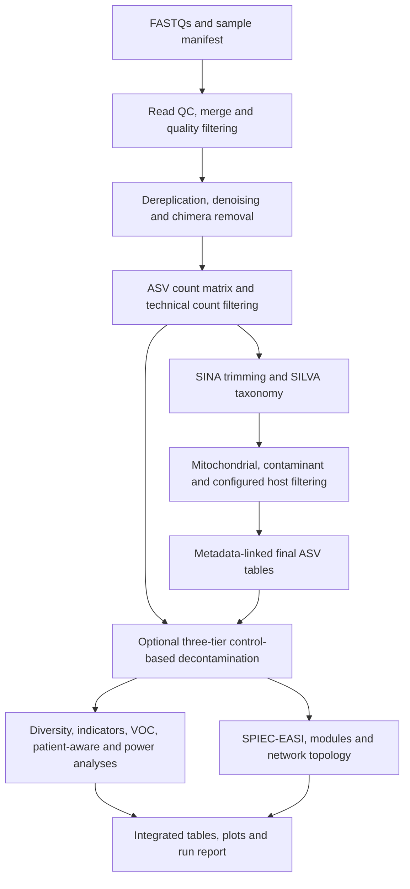

# ASPIRE

ASPIRE is a Nextflow DSL2 workflow for ASV generation, taxonomy assignment, decontamination, metadata-linked ASV summaries, ecological analyses, VOC association analyses, network/module analyses, and optional ASV-to-MAG linkage.

The supported entrypoint is `run_asv_pipeline.sh`. It bootstraps the controller environment, launches `asv_pipeline.nf`, manages resume behavior, and supports stage-aware reruns with `--rerun-from`.

## Choose Your Route

| Goal | Start here |
|---|---|
| Review ASPIRE with the public test data | [Mock Dataset Quick Start](#mock-dataset-quick-start) |
| Run paired-end data from a new study | [General Quick Start](#general-quick-start) and [Inputs](#inputs) |
| Understand what enters each analysis | [Workflow Overview](#workflow-overview) and [Workflow Stages](#workflow-stages) |
| Configure a module | [Configuration Reference](docs/CONFIGURATION.md) and [complete parameter catalogue](docs/CONFIG_PARAMETERS.md) |
| See exactly what each process consumes and writes | [Process and I/O Reference](docs/PROCESS_REFERENCE.md) |
| Resume, selectively rerun, or diagnose a run | [Expert Guide](docs/EXPERT_GUIDE.md) |
| Check manuscript functionality | [SPARK Functionality Crosswalk](docs/SPARK_FUNCTIONALITY.md) |
| Diagnose a common failure | [Troubleshooting](#troubleshooting) |

The mock-data route is recommended for reviewers and first-time users. It
exercises the complete applicable analysis graph without requiring access to
protected patient data. Study-specific YAML files contain local absolute paths
and study provenance, so they are intentionally excluded from the repository.

Configuration and stage names use three explicit tiers:

- `core`: always-scheduled ASV construction and taxonomy.
- `standard`: canonical final-table preparation required by the usual
  downstream analytical workflow.
- `optional`: independently selectable analyses and reporting branches.

An optional section may be `enabled: true` in a supplied benchmark because the
benchmark intentionally exercises it; this does not make that process mandatory
for every study. The launcher prints the organized execution registry using
names such as `core:FASTP_QC`, `standard:FILTER_COUNTS`, and
`optional:VOC_CORRELATION`. The live ANSI dashboard uses the corresponding real
Nextflow scopes: `core`, `standard`, and `optional`.

## Workflow Overview



The diagram describes data dependencies rather than a serial schedule;
Nextflow runs independent tasks concurrently. The three-tier branch is optional
and uses the raw control-bearing count matrix to score contaminants, then
applies those decisions to the final microbial tables before downstream
analysis. Network edges and ASV-VOC correlations are statistical associations,
not evidence of physical interaction or causation.

## Key Files

- `run_asv_pipeline.sh`: main wrapper for routine runs.
- `asv_pipeline.nf`: current Nextflow workflow.
- `asv_pipeline_nextflow.yml`: authoritative complete config template with every supported parameter.
- `examples/mock.local.yml`: full-module template used by the portable mock config generator.
- `examples/configure_mock_run.sh`: validates a supplied mock fixture and writes a machine-local YAML.
- `examples/validate_mock_run.sh`: validates the completed mock run against its truth contract.
- `examples/MOCK_DATASET_TESTING.md`: expanded mock test instructions.
- `docs/CONFIGURATION.md`: main-branch configuration and dependency reference.
- `docs/CONFIG_PARAMETERS.md`: exhaustive key-by-key definitions and template values.
- `docs/EXPERT_GUIDE.md`: restart, cache, resource, and diagnostic guidance.
- `docs/PROCESS_REFERENCE.md`: process purpose, inputs, and published outputs.
- `docs/SPARK_FUNCTIONALITY.md`: manuscript-to-workflow functionality crosswalk.
- `processes/`: scripts and conda environment YAMLs used by individual stages.

## Requirements

ASPIRE is developed for a 64-bit Linux environment. Before starting, install:

- Bash and standard GNU command-line utilities.
- Conda or Mamba, with `mamba` available on `PATH`.
- Git for obtaining and identifying the workflow revision.
- Internet access on the first run to solve Conda environments and download
  configured SINA and QIIME2/SILVA references. Fully offline runs require
  pre-populated package caches and local reference paths.

The wrapper creates a repository-local controller environment containing
Nextflow and its Java runtime, then creates process-specific environments from
the committed YAML definitions. Users should not manually combine all process
dependencies into one environment. ASPIRE isolates the run's package cache and
serializes Conda environment creation to prevent concurrent repodata-lock
failures. Environment solves use strict channel priority to avoid pathological
cross-channel backtracking, and module-specific environments avoid the legacy
all-in-one dependency search space. Builds are terminated after 30 minutes by
default rather than hanging indefinitely; set `ASPIRE_MAMBA_BUILD_TIMEOUT` only
when a slower package source is expected. Analysis tasks remain parallel.

Resource needs depend on sample count and sequencing depth. For the complete
mock benchmark, provision at least 8 CPU cores, 32 GB RAM, and 50 GB of free
storage for input data, Conda environments, Nextflow work files, downloaded
references, and final outputs. `core.resources.threads` controls per-task CPU use; it
does not limit the total storage used by cached tasks.

Verify the entrypoint prerequisites:

```bash
command -v bash
command -v git
command -v mamba
```

If `mamba` is unavailable, install a current Miniforge distribution from
<https://github.com/conda-forge/miniforge> and open a new shell before running
ASPIRE.

## Mock Dataset Quick Start

Download and extract the ASPIRE mock dataset from
[Zenodo (DOI: 10.5281/zenodo.22906294)](https://doi.org/10.5281/zenodo.22906294).
The [direct Zenodo record](https://zenodo.org/records/22906294) provides the
dataset archive used by this test.

After extraction, the complete reviewer test is this copy/paste sequence (edit
only the first two paths):

```bash
DATASET=/absolute/path/to/mock_dataset
RESULTS=/absolute/path/to/aspire_mock_output

./examples/configure_mock_run.sh \
  --dataset "$DATASET" \
  --output "$RESULTS" \
  --config-out mock_run.generated.yml
./run_asv_pipeline.sh mock_run.generated.yml --no-resume
./examples/validate_mock_run.sh --dataset "$DATASET" --results "$RESULTS"
```

The expected final message is `All mock-run checks passed.` The remainder of
this section explains prerequisites, outputs, validation, and recovery in more
detail.

Clone ASPIRE and record the exact revision:

```bash
git clone --branch main --single-branch https://github.com/hallamlab/ASPIRE.git
cd ASPIRE
git rev-parse HEAD
```

Using the extracted `mock_dataset/`, generate a portable configuration. Do not
edit the developer paths in `examples/mock.local.yml`:

No controller-environment setup or activation is required. The configuration
script creates or updates `.controller_env`, and the run and validation wrappers
reuse it automatically.

```bash
./examples/configure_mock_run.sh \
  --dataset /absolute/path/to/mock_dataset \
  --output /absolute/path/to/aspire_mock_output \
  --config-out mock_run.generated.yml
```

Run every benchmarked module except optional ASV-to-MAG linkage:

```bash
./run_asv_pipeline.sh mock_run.generated.yml --no-resume
```

Validate both technical completion and recovery of the dataset's known signals:

```bash
./examples/validate_mock_run.sh \
  --dataset /absolute/path/to/mock_dataset \
  --results /absolute/path/to/aspire_mock_output
```

Success is reported as `All mock-run checks passed.` with exit status zero. The
validator derives sample counts from the supplied manifest and metadata, checks
known mitochondrial/contaminant removal, confirms taxonomy and statistical
outputs, rejects a degenerate network, verifies SVG production, and checks every
published module file against its SHA-256 manifest. See
`examples/MOCK_DATASET_TESTING.md` for the dataset schema, restart instructions,
and interpretation of failed checks.

The visible output directories are created when the run starts and updated only
after the workflow completes successfully. Nextflow work files, Conda environments,
and internal staging persist under `<output_dir>/.aspire/`, allowing the same command
to resume interrupted, failed, or completed runs without a separate temporary tree.

For a reproducibility record, retain the ASPIRE Git commit, supplied dataset
checksum table, generated YAML and manifest, launch command, and the completed
`summary/tables/` directory. The latter records the resolved run configuration,
input manifest, reference checksums, module inventory, output SHA-256 values,
and integrated master tables.

**Review the mock outputs:** Open
`<output_dir>/summary/report/ASPIRE_run_report.html` in a web browser as the
starting point for reviewing the completed run. Its opening **Data Accounting
Summary** reports analyzed samples, participants, study-group counts, sequence
totals, and retained ASVs, followed by the filtering Sankey, read-depth
swarmplot, ASV-overlap UpSet plot, and collector's curves. The **Output
Inventory** summarizes the number of tables and plots produced by each module
and links directly to their locations under `<output_dir>/modules/`. The final
**Nextflow run details** section links the execution report, timeline, trace,
workflow DAG, launch command, version record, controller log, task inventory,
and per-task logs under `<output_dir>/logs/`. Exact output paths and SHA-256
checksums remain available in `<output_dir>/summary/tables/`. The report is an
accounting and navigation aid; it does not provide biological interpretation.

## General Quick Start

Create a run config from the full template, then edit all paths for your environment:

```bash
cp asv_pipeline_nextflow.yml my_run.yml
```

At minimum, review:

- `core.paths.input_dir`
- `core.paths.output_dir`
- `core.paths.manifest`
- `core.paths.runtime_dir`
- `core.paths.keep_runtime_dir`
- `core.paths.work_dir`
- `core.paths.conda_cache_dir`
- any `/abs/path/...` placeholder
- enabled optional branches that require metadata, reference databases, VOC tables, or genome/MAG inputs

Run the pipeline:

```bash
./run_asv_pipeline.sh my_run.yml
```

List valid stage names for targeted reruns:

```bash
./run_asv_pipeline.sh --list-stages
```

Force a rerun from one stage onward using the retained default runtime cache:

```bash
./run_asv_pipeline.sh my_run.yml --rerun-from standard:PLOT_METADATA
```

Pass extra Nextflow options after `--`:

```bash
./run_asv_pipeline.sh my_run.yml -- -with-report report.html -with-trace trace.tsv
```

Direct Nextflow invocation is intended only for debugging because public-output
finalization is performed by the wrapper:

```bash
nextflow run asv_pipeline.nf --params-file my_run.yml --pipeline_config my_run.yml
```

**Review the outputs:** After a successful wrapper run, open
`<output_dir>/summary/report/ASPIRE_run_report.html` in a web browser. This is
the recommended starting point before biological interpretation. Review the
opening **Data Accounting Summary** for sample and group composition, sequence
and ASV retention, and the Sankey, swarmplot, UpSet, and collector's-curve
figures. Use the **Output Inventory** to open each enabled module's tables and
plots under `<output_dir>/modules/`. Use **Nextflow run details** to inspect task
status and resource use, execution timing, the workflow DAG, trace data,
software/runtime records, and controller or per-task logs under
`<output_dir>/logs/`. Machine-readable inventories, exact paths, and checksums
are stored under `<output_dir>/summary/tables/`.

## Inputs

FASTQs can be discovered from `core.paths.input_dir`. Every run writes a normalized,
reusable manifest to `<output_dir>/summary/tables/run_manifest.tsv`, regardless of
whether discovery or `core.paths.manifest` supplied the inputs.

Manifest format:

- Tab-separated; the `sample_id`, `fastq_r1`, `fastq_r2` header is optional.
- Column 1: `sample_id`.
- Column 2: R1 FASTQ.
- Column 3: R2 FASTQ, optional for single-end data.
- Lines starting with `#` are ignored.
- Relative FASTQ paths are resolved relative to the manifest file.

See `examples/manifest.template.tsv` for a reusable template.

Metadata is required by enabled metadata-aware branches such as metadata plots, Sankey, diversity, indicator species, VOC correlation, power analysis, taxonomy patient-aware analysis, lung-status analysis, and several network overlays. The configured sample column must match the manifest sample IDs.

Metadata column names are configured per run (`sample_col`, `type_col`,
`case_col`, `patient_col`, and related settings); ASPIRE does not require fixed
study-specific names. If the configured color column is absent, ASPIRE assigns
deterministic colors and writes both an augmented metadata table and a reusable
two-column palette under `<output_dir>/modules/metadata_plots/tables`. Set `palette_file` in
`standard.metadata_plots` or `optional.sankey` to override it. See
`examples/metadata_palette.template.tsv`.

Reference inputs depend on enabled branches:

- `core.sina.reference` and `core.taxonomy` references are used for SINA alignment and taxonomy assignment. The config can point at local files or URLs.
- Mitochondrial/contaminant decontamination accepts existing database prefixes
  through `standard.mito.mito_db` and `standard.mito.biof_db`, or FASTA inputs through
  `standard.mito.mito_fasta` and `standard.mito.contaminant_fasta`. ASPIRE exports/copies and
  rebuilds both as run references under `<output_dir>/references/reference/blast_databases`.
- `standard.mito.run_mitomaster: false` skips the external MITOMASTER service while
  retaining taxonomy and local BLAST screens, which is useful for offline tests.
- `optional.voc_correlation.voc_table` is required when VOC correlation is enabled.
- `optional.asv_mag_link.*` inputs are required only when ASV-to-MAG linkage is enabled.

## Complete Configuration Reference

Use [`asv_pipeline_nextflow.yml`](asv_pipeline_nextflow.yml) as the authoritative
complete, machine-editable template. The
[configuration guide](docs/CONFIGURATION.md) explains dependencies and
scientific interpretation, and the exhaustive
[parameter catalogue](docs/CONFIG_PARAMETERS.md) defines every key and shows
its template value. Begin with a copy rather than editing the repository
template, and disable optional modules whose required inputs are unavailable.

## Workflow Stages

The wrapper's current tier-qualified stage registry is shown below. These names
are accepted by `--rerun-from`; legacy bare process names remain accepted.

1. `core:FASTP_QC`
2. `core:MERGE_READS`
3. `core:FILTER_READS`
4. `core:RELABEL_FILTERED`
5. `core:CONCAT_FASTAS`
6. `core:DEREPLICATE`
7. `core:DENOISE`
8. `core:CHIMERA_CHECK`
9. `core:CREATE_COUNT_MATRIX`
10. `core:FILTER_TABLE`
11. `core:SINA_TRIM`
12. `core:TAXONOMY`
13. `standard:PREPARE_BLAST_DATABASES`
14. `standard:MITOMASTER`
15. `standard:MITO_DECONTAM`
16. `standard:FILTER_COUNTS`
17. `standard:GENERAL_STATS`
18. `standard:PLOT_METADATA`
19. `optional:THREE_TIER_DECONTAM`
20. `optional:PLOT_UPSET`
21. `optional:ASV_BATCH_CORRECTION`
22. `optional:ASV_META_FROM_CORRECTED`
23. `optional:BUBBLEPLOTTER`
24. `optional:UMAP_CLUSTERING`
25. `optional:OUTLIER_CHECKER`
26. `optional:COLLECTORS_CURVE`
27. `optional:DIVERSITY_ANALYSIS`
28. `optional:INDICSPECIES`
29. `optional:INDICSPECIES_PLOTS`
30. `optional:INDICSPECIES_ALIGNED_PLOTS`
31. `optional:VOC_CORRELATION`
32. `optional:CLUSTERMAPS`
33. `optional:POWER_ANALYSIS_PIPELINE`
34. `optional:TAXONOMY_PATIENT_AWARE`
35. `optional:LUNG_STATUS_ANALYSIS`
36. `optional:SPIECEASI`
37. `optional:NETWORK_TOPOLOGY`
38. `optional:NETWORK_MODULES`
39. `optional:ASV_MAG_LINK`
40. `optional:GRAPH_NETWORK`
41. `optional:MODULE_MAG_ANCHORS`
42. `optional:SANKEY`
43. `optional:MASTER_SUMMARY`

Disabled optional branches are skipped based on the YAML config.

## Scripts Used By Stage

Stages that do not list a custom ASPIRE script are executed directly by Nextflow using command-line tools. In the core ASV path, fastp is used for read trimming, vsearch is used for read merging, quality filtering, dereplication, denoising, chimera removal, and read-to-ASV mapping, SINA is used for sequence alignment before region trimming, seqkit is used for sequence splitting/statistics, and blastn is used for mitochondrial and contaminant database searches.

| Workflow stage | Script used | Purpose |
|---|---|---|
| Pipeline launch | `run_asv_pipeline.sh` | Initializes the controller environment, resolves work/cache directories, and launches `asv_pipeline.nf` with the selected YAML config. |
| Output finalization | `processes/output_layout/organize_outputs.py` | Atomically publishes runtime staging into module tables/plots, intermediates, references, logs, and integrated summary manifests. |
| Workflow orchestration | `asv_pipeline.nf` | Defines process order, config parsing, inputs/outputs, conda environments, and enabled/disabled analysis branches. |
| `FILTER_TABLE` | `processes/filter_table/filter_ASV_table.py` | Filters the intermediate ASV count table by minimum sample read depth and minimum ASV abundance. |
| `SINA_TRIM` | `processes/sina_trim/parse_sina_log.py` | Parses SINA variable-region annotations from SINA logs. |
| `SINA_TRIM` | `processes/sina_trim/trim_v_sina.py` | Trims dereplicated ASV sequences to configured variable regions. |
| `TAXONOMY` | `processes/taxonomy/qiime_vs_classifier.py` | Calls the QIIME2 Python API and q2-feature-classifier to classify ASVs against configured SILVA artifacts. |
| `PREPARE_BLAST_DATABASES` | Command-line `blastdbcmd` and `makeblastdb` | Normalizes configured FASTA files or existing nucleotide database prefixes into archived run-specific BLAST databases. |
| `MITOMASTER` | `processes/mitomaster/mitomaster.py` | Queries MITOMASTER for candidate mitochondrial ASVs. |
| `MITO_DECONTAM` | `processes/mito_decontam/mito_checker.py` | Integrates MITOMASTER, mitochondrial blastn, contaminant blastn, and taxonomy evidence into non-target calls and plots. |
| `FILTER_COUNTS` | `processes/filter_counts/filter_nontarget.py` | Removes non-target, mitochondrial, low-abundance, low-quality taxonomy, and explicitly excluded taxa; writes final `ASV_target.tsv`. |
| `PLOT_METADATA` | `processes/plot_metadata/plot_metadata.py` | Merges ASV counts with metadata, applies configured control subtraction, and writes ASV metadata tables and plots. |
| `THREE_TIER_DECONTAM` | `processes/three_tier_decontam/pipeline/` | Optionally scores contaminants from the raw control-bearing count table, applies pooled prevalence, within-sample-type frequency, and biological-plausibility filters to the final microbial tables, and supplies those filtered tables to every downstream analysis. |
| `SANKEY` | `processes/sankey/sankey_builder.py` | Builds data-loss Sankey and sample-retention summaries from raw, filtered, decontaminated, and final tables. |
| `PLOT_UPSET` | `processes/plot_upset/plot_upset.py` | Produces ASV/sample overlap plots for raw/final microbial and mitochondrial tables. |
| `BUBBLEPLOTTER` | `processes/bubbleplotter/bubbleplotter.py` | Generates metadata-linked ASV bubble plots. |
| `UMAP_CLUSTERING` | `processes/umap_clustering/umap_clustering.py` | Generates UMAP/HDBSCAN summaries from ASV-linked metadata tables. |
| `ASV_BATCH_CORRECTION` | `processes/asv_batch_correction/asv_batch_correction.py` | Performs optional ASV abundance batch correction and diagnostics. |
| `OUTLIER_CHECKER` | `processes/outlier_checker/outlier_checker.py` | Performs optional outlier detection from configured ASV abundance inputs. |
| `COLLECTORS_CURVE` | `processes/collectors_curve/collectors_curve.py` | Produces species/ASV accumulation curves by metadata group. |
| `DIVERSITY_ANALYSIS` | `processes/diversity_analysis/calc_div.py` | Calculates Shannon diversity, Bray-Curtis distance, and Jaccard distance. |
| `DIVERSITY_ANALYSIS` | `processes/diversity_analysis/plot_diversity.py` | Generates diversity plots, UMAPs, heatmaps, and PERMANOVA outputs. |
| `DIVERSITY_ANALYSIS` patient-aware sub-branch | `processes/bray_patient_aware/run_bray_permanova_patient_aware.R` | Runs optional patient-aware Bray-Curtis PERMANOVA analyses. |
| `DIVERSITY_ANALYSIS` patient-aware sub-branch | `processes/bray_patient_aware/plot_bray_permanova_patient_aware.py` | Plots patient-aware Bray-Curtis PERMANOVA outputs. |
| `INDICSPECIES` | `processes/indicspecies/run_indicspecies.R` | Runs indicator species analysis with the R `indicspecies` package. |
| `INDICSPECIES_PLOTS` | `processes/indicspecies_plots/plot_indicspecies.py` | Generates standard indicator species plots and summaries. |
| `INDICSPECIES_PLOTS` aligned sub-branch | `processes/indicspecies_aligned_plots/plot_indicspecies_aligned.py` | Generates optional aligned indicator species summaries and figures. |
| `VOC_CORRELATION` | `processes/voc_correlation/plot_voc_corr.py` | Preserves exploratory sample correlations; adds patient-level relative-abundance permutation tests, CLR sensitivity, FDR, and patient-level cancer–control tests. See [VOC statistics](docs/VOC_STATISTICS.md). |
| `CLUSTERMAPS` | `processes/clustermaps/plot_clustermaps.py` | Generates ASV and metadata clustermaps from configured count and metadata inputs. |
| `POWER_ANALYSIS_PIPELINE` input build | `processes/master_summary/build_master_asv_summary.py` | Builds long-format ASV summary inputs used by the power-analysis branch. |
| `POWER_ANALYSIS_PIPELINE` | `processes/power_analysis_pipeline/run_power_analysis_pipeline.sh` | Launches the power-analysis subworkflow. |
| `POWER_ANALYSIS_PIPELINE` subworkflow | scripts under `processes/power_analysis_pipeline/` | Runs simulation-based power analyses for diversity, taxonomic abundance, indicator species, and related plotting. |
| `TAXONOMY_PATIENT_AWARE` input build | `processes/master_summary/build_master_asv_summary.py` | Builds long-format ASV summary inputs used by taxonomy patient-aware analyses. |
| `TAXONOMY_PATIENT_AWARE` | `processes/taxonomy_patient_aware/run_taxonomic_abundance_analysis.py` | Runs patient-level taxonomic abundance comparisons between disease/control groups. |
| `TAXONOMY_PATIENT_AWARE` | `processes/taxonomy_patient_aware/run_taxonomic_sample_type_analysis.py` | Runs paired or sample-type taxonomic abundance comparisons. |
| `TAXONOMY_PATIENT_AWARE` | `processes/taxonomy_patient_aware/plot_taxonomic_observed_analysis.py` | Plots observed taxonomic abundance analysis outputs. |
| `LUNG_STATUS_ANALYSIS` input build | `processes/master_summary/build_master_asv_summary.py` | Builds long-format ASV summary inputs used by lung-status analyses. |
| `LUNG_STATUS_ANALYSIS` | `processes/lung_status_analysis/prepare_lung_status_data.py` | Derives lung-status labels and prepares per-sample/per-patient tables. |
| `LUNG_STATUS_ANALYSIS` | `processes/lung_status_analysis/run_lung_status_analysis.R` | Runs lung-status statistical analyses. |
| `LUNG_STATUS_ANALYSIS` | `processes/lung_status_analysis/plot_lung_status_analysis.py` | Plots lung-status analysis outputs. |
| `SPIECEASI` | `processes/spieceasi/run_spieceasi.R` | Runs SPIEC-EASI graphical lasso network inference and exports graph/network tables. |
| `NETWORK_MODULES` | `processes/network_modules/network_modules.R` | Detects network modules using configured Leiden/Louvain methods. |
| `NETWORK_TOPOLOGY` | `processes/network_topology/network_topology_stats.py` | Reports network size, density, degree, connected components, transitivity, local clustering, and a seeded degree-preserving null-network comparison as used in the SPARK supplement. |
| `GRAPH_NETWORK` | `processes/graph_network/graph_network.py` | Generates network visualizations and ASV/node annotations. |
| `MODULE_MAG_ANCHORS` | `processes/module_mag_anchors/summarize_module_mag_anchors.py` | Summarizes MAG-linked ASVs within network modules. |
| `MASTER_SUMMARY` | `processes/master_summary/build_master_asv_summary.py` | Builds final combined ASV summary tables integrating taxonomy, metadata, indicator species, network, VOC, and optional MAG information. |
| `ASV_MAG_LINK` | `processes/asv_mag_link/asv_mag_barrnap_linker.py` | Links ASVs to barrnap-derived SSU/16S sequences from genome/MAG inputs. |
| `ASV_MAG_LINK` | `processes/asv_mag_link/plot_asv_mag_link.py` | Plots ASV-MAG linkage summaries. |

## Indicator Species Analysis

`INDICSPECIES` runs the primary analyses listed in `optional.indicspecies.group_cols` when enabled, preserving the standard outputs such as `Type_Group_indicator_species_summary.tsv` and `Case_indicator_species_summary.tsv`.

Additional nested ISA runs can be requested with `optional.indicspecies.stratified`. Each analysis tests `group_col` separately within each selected `within_col` value. For example, the VOC-enabled example config tests cancer/control indicators within each respiratory sample type:

```yaml
optional:
  indicspecies:
    stratified:
      enabled: true
      analyses:
        - within_col: Type_Group
          group_col: Case
          levels:
            - Oral Rinse
            - BAL
            - Bronchial Brush
```

These stratified runs write per-level and pooled tables named like `stratified_Case_within_Type_Group_Bronchial_Brush_indicator_species_summary.tsv` and `stratified_Case_within_Type_Group_indicator_species_summary.tsv`.

## Count Filtering

`FILTER_COUNTS` produces the ASV count tables used by downstream analyses. The important outputs are:

- `ASV_target.tsv`: final microbial ASV table after contaminant removal, mitochondrial removal, abundance/prevalence filtering, taxonomy-quality filtering, and explicit taxon exclusions.
- `ASV_target.micro.tsv`: intermediate microbial table before final abundance/taxonomy filtering; kept for audit and data-loss summaries.
- `ASV_target.decon.tsv`: intermediate decontaminated table.
- `ASV_target.mito.tsv`: mitochondrial table.

Downstream metadata and VOC analyses use `ASV_target.tsv`, not the intermediate `.micro.tsv`, so taxa excluded by final filtering should not re-enter later outputs.

Explicit taxon exclusions are configured with `standard.filter_counts.exclude_taxa`. Entries are exact, case-insensitive matches against parsed taxonomy ranks, and underscores in configured values are normalized to spaces. Supported forms include strings, maps, and mixed lists:

```yaml
standard:
  filter_counts:
    enabled: true
    exclude_taxa:
      - "Species:Homo sapiens"
      - "Class:Mammalia"
      - Order: Primates
```

Use this for host or other known non-target ranks that should be removed even if they pass sequence and abundance filters.

## Optional Three-Tier Decontamination

Set `optional.three_tier_decontam.enabled: true` to run the SPARK manuscript contamination screen after `PLOT_METADATA` and before batch correction, diversity, indicator-species, SPIEC-EASI/network, VOC, clustermaps, and the other downstream modules. The statistical model uses the raw pre-filter ASV count matrix so negative controls remain available, while its decisions are applied to the final host-filtered long and wide microbial tables.

```yaml
optional:
  three_tier_decontam:
    enabled: true
    metadata: /path/to/sample_metadata.tsv
    output_dir: three_tier_decontam
    metadata_sample_col: Sample
    sample_types: [BAL, Bronchial Brush, Oral Rinse]
    pooled_threshold: 0.1
    within_type_threshold: 0.1
    aggressive_threshold: 0.5
    combine_mode: min
    biological_plausibility: true
```

The complete score tables, flags, taxonomy audit, read-loss summary, and filtered long/wide tables are published under the configured `output_dir`. The module is disabled by default. For `RUN_FROM_FINAL_CHECKPOINT`, set `checkpoint.raw_asv_counts` to the original control-bearing count matrix; falling back to `checkpoint.asv_counts` is only valid when that table still contains the negative controls.

## Metadata And ASV Outputs

`PLOT_METADATA` builds the run's metadata-linked ASV products. Typical outputs include:

- `modules/metadata_plots/tables/ASV_meta_micro.tsv`
- `modules/metadata_plots/tables/ASV_final.micro.tsv`
- `modules/metadata_plots/tables/metadata_updated_micro.tsv`
- `modules/metadata_plots/tables/master_table_micro.tsv`
- run metadata summaries and plots

When batch correction is enabled, corrected count and metadata tables are produced and downstream branches that support corrected inputs use them.

## VOC Correlation

`VOC_CORRELATION` links VOC abundances to filtered ASV abundances. It requires `optional.voc_correlation.enabled: true`, a metadata table, the final filtered ASV counts, and `optional.voc_correlation.voc_table`.

Direction filtering is controlled by:

```yaml
optional:
  voc_correlation:
    enabled: true
    correlation_direction: positive  # positive, negative, or both
```

This setting applies to ASV-VOC correlation tables and ASV-VOC correlation heatmaps. For example, `positive` keeps only positive ASV-VOC correlations in the reported long table and correlation clustermap, allowing statements such as "VOC abundance was positively correlated with ASV X." Multiple-testing q-values are computed across the tested ASV-VOC pairs before direction filtering.

VOC abundance plots are different from correlation plots:

- `asv_voc_clustermap*` shows ASV-VOC correlation values and respects `correlation_direction`.
- `sample_voc_brush_clustermap*` shows per-sample VOC abundance z-scores, not correlations. Blue indicates lower-than-average VOC abundance for that VOC, white is near the VOC mean, and orange indicates higher-than-average abundance.
- `patient_case_voc_barplots_brush*` displays per-VOC patient z-scores so VOCs are visually comparable on one axis; statistical tests are still run on original patient-level VOC values.

## Standard and Optional Branches

The standard final-table sections are `standard.mito`,
`standard.filter_counts`, `standard.general_stats`, and
`standard.metadata_plots`. They perform non-target screening, final count
filtering, run summaries, and metadata-linked final-table construction.

Selectable analyses live under `optional` and are controlled by their
`enabled` flags:

- `optional.three_tier_decontam`: control-based prevalence, frequency, and biological-plausibility decontamination.
- `optional.plot_upset`, `optional.bubbleplotter`, `optional.umap_clustering`: metadata visualization branches.
- `optional.batch_correction` and `optional.outlier_detection`: corrected ASV tables and outlier checks.
- `optional.collectors_curve`: rarefaction/collector curve summaries.
- `optional.diversity`: Shannon, Bray-Curtis, Jaccard, and patient-aware diversity workflows.
- `optional.indicspecies`: indicator species tables, standard plots, and aligned indicator plots.
- `optional.voc_correlation`: VOC-ASV association analysis and VOC abundance visualizations.
- `optional.clustermaps`: ASV and metadata heatmaps.
- `optional.spieceasi`: SPIEC-EASI inference, module detection, network visualization, and optional module/MAG anchor tables.
- `optional.network_topology`: SPARK-compatible global topology statistics and degree-preserving null-network comparison.
- `optional.power_analysis`: patient-aware power analysis using metadata-linked ASV tables.
- `optional.taxonomy_patient_aware`: patient-aware taxonomic comparisons.
- `optional.lung_status_analysis`: patient-aware lung-status comparisons.
- `optional.asv_mag_link`: ASV-to-MAG/barrnap linkage and module anchoring.
- `optional.sankey`: data-loss and filtering Sankey summaries.
- `optional.master_summary`: final combined ASV summary export.

## SPARK Supplement Functionality

The reviewer-facing mapping from analyses reported in the SPARK and ASPIRE
manuscripts to workflow switches, implementations, and outputs is documented in
[`docs/SPARK_FUNCTIONALITY.md`](docs/SPARK_FUNCTIONALITY.md). The private
manuscript-scale run uses 1,000 degree-preserving null networks. The public mock
configuration uses 100 draws to demonstrate the same method in less time.

## Output Structure

Successful wrapper runs atomically publish a clean output tree:

```text
<output_dir>/
├── .aspire/             # persistent Nextflow work, Conda cache, and internal staging
├── modules/
│   └── <module>/
│       ├── tables/
│       └── plots/
├── intermediates/
├── references/
├── summary/
│   ├── tables/
│   ├── plots/
│   └── report/
└── logs/
```

Each enabled analytical module receives both `tables/` and `plots/`, even when
one is empty. `intermediates/` contains core FASTQ, FASTA, and ASV-processing
artifacts. `summary/tables/module_output_manifest.tsv` inventories and
checksums every module deliverable. The summary also contains the supplied run
configuration, normalized input manifest, per-module file/size totals,
reference checksums, an intermediate-file inventory, and the integrated master
ASV tables when `master_summary` is enabled. `summary/plots/module_output_summary.svg`
visualizes the published module inventory, and
`summary/report/ASPIRE_run_report.html` provides
an integrated, navigable run report. Its opening data-accounting section summarizes
analyzed samples, participants, group membership, retained ASVs, and sequence totals,
and displays the Sankey, read-depth swarmplot, and ASV-overlap UpSet without adding
biological interpretation. A combined collector's curve adds descriptive sampling-
coverage context. The report then inventories module outputs and links to
Nextflow's execution report, timeline, trace table, and workflow DAG. These artifacts are generated by
default under `logs/`, alongside the recorded launch command and Nextflow
version. `logs/controller.log` captures the complete Nextflow/controller stream;
`logs/task_execution.tsv` and `logs/tasks/` preserve the command, stdout, stderr,
trace, and exit code available for every task in the completed run. External
Nextflow integrations that require services or credentials, such as Tower,
webhooks, notifications, and telemetry exporters, remain opt-in. The publication
also writes `summary/tables/nextflow_artifact_manifest.tsv` with paths, sizes,
and SHA-256 checksums for all archived run records. The publication is assembled from runtime
staging only after Nextflow succeeds, so the visible output is never left in a
half-organized state.

## Runtime And Cache Behavior

By default, an output such as `/project/run/ASPIRE_output` keeps its runtime
state in a hidden directory inside that output:

```text
ASPIRE_output/.aspire/
├── nf_work/
├── conda_cache/
└── publication_staging/
```

The wrapper creates the visible modular directories at run start. After a
successful workflow, it atomically replaces only `modules/`, `intermediates/`,
`references/`, `summary/`, and `logs/`; `.aspire/` is never replaced during
publication. Set `core.paths.runtime_dir` to relocate the runtime tree. Runtime state
is retained by default so normal `-resume` and `--rerun-from` execution remains
available after successful, failed, and interrupted runs. Set
`core.paths.keep_runtime_dir: false` only when the cache should be discarded after a
successful run. Explicit
`core.paths.work_dir` and `core.paths.conda_cache_dir` values override their respective
derived paths.

Rerunning the same wrapper command resumes from the retained Nextflow cache. If a
branch does not rerun because cached outputs are valid, use `--rerun-from STAGE_NAME`.

Several stages include checksums of external process scripts in their task commands, so edits to important Python/R helper scripts invalidate the relevant Nextflow task cache. This avoids stale outputs when a script changes but the input filenames stay the same.

## Troubleshooting

If environment creation fails while collecting repodata with
`BlockingIOError: [Errno 11] Resource temporarily unavailable`, the failure is
a Conda cache-lock collision rather than evidence of an unavailable package.
Current wrapper runs use a run-local package cache and serialize environment
creation through `flock`. Restart the failed run normally; its retained
Nextflow work directory remains resumable. DNS, connection-timeout, or HTTP
errors instead indicate network or repository availability and are retried by
the controller before the run fails.

Interrupted Nextflow sessions can also leave `.env-*.lock` marker files even
when no `mamba` process remains. The wrapper takes an exclusive lock on the
configured Conda cache, rejects concurrent runs that share that cache, and then
removes these orphaned markers automatically. Messages about waiting for the
serialized mamba slot indicate active environment creation, not a deadlock.

- `No usable entries detected in manifest`: check tab separation, sample IDs, and FASTQ paths.
- `metadata file not found`: set the branch-specific metadata path or disable that branch.
- Host taxa still appear downstream: confirm `standard.filter_counts.exclude_taxa` is set and rerun from `standard:FILTER_COUNTS` or at least from `standard:PLOT_METADATA` if the final `ASV_target.tsv` is already corrected.
- VOC direction did not change outputs: rerun from `VOC_CORRELATION`.
- Sankey complains about intermediates: set `standard.filter_counts.save_intermediates: true`.
- BLAST database errors: set `standard.mito.mito_db` and `standard.mito.biof_db` to valid database prefixes or compatible FASTA paths.
- Conda solve errors: confirm `mamba` is available and review the relevant `environments.*` config entry.
