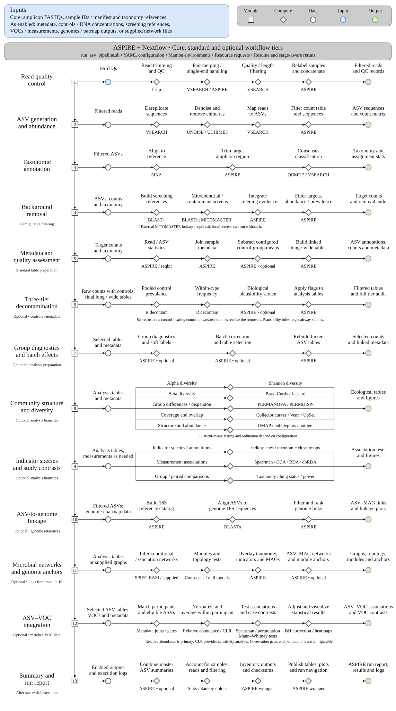
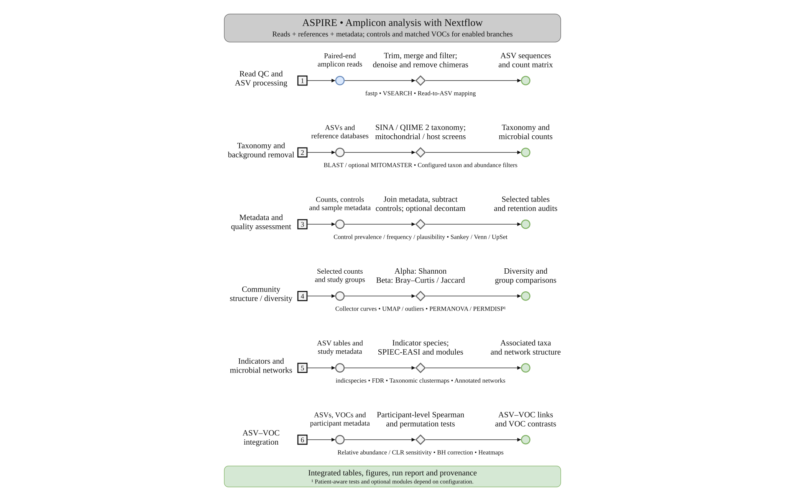

# Workflow, architecture and data flow

```{container} aspire-primary-workflow
[](assets/workflow.svg)
```

[Download SVG](assets/workflow.svg) · [Download PDF](assets/workflow.pdf)

Figures follow the shared [MP nodal style](WORKFLOW_STYLE.md): numbered module squares, compute diamonds and data circles. Process names sit above diamonds; the main software tools or libraries sit below them.

The core path is optional primer removal → read QC and ASV construction → full taxonomy → optional
`CONTROL_DECONTAM` → reference screening → `FILTER_ASVS` → `PLOT_METADATA`.
Independent downstream analyses can overlap when dependencies and resources allow.
The [process reference](PROCESS_REFERENCE.md) lists task identifiers and outputs.

## Conceptual workflow

[](assets/diagrams/workflow-1.svg)

[Mermaid source](diagrams/workflow-1.mmd)

Control prevalence filtering applies biological-only depth QC, runs separate
TECH/BIO tests, and removes their union before microbial feature filtering. Batch correction and proposed group
labels are separately configurable. Network edges and ASV–VOC correlations are
associations, rather than evidence of causal relationships.

## Software architecture

[](assets/diagrams/workflow-2.svg)

[Zoom diagram](assets/diagrams/workflow-2.svg) · [Mermaid source](diagrams/workflow-2.mmd)

The supported entrypoint is the wrapper. It handles environment setup, resume,
logging and final publication. Independent tasks can overlap when resources
permit. Per-task threads are not a global concurrency limit. See
[expert execution guidance](EXPERT_GUIDE.md) before changing runtime locations
or passing native Nextflow options.

## Data flow and the selected analysis table

[](assets/diagrams/workflow-3.svg)

[Mermaid source](diagrams/workflow-3.mmd)

The diagrams summarize the analytical table path. Individual descriptive
products can use their own declared metadata or intermediate inputs; consult
the process I/O reference before treating every report panel as the same cohort.
ASV-to-genome linkage uses the filtered ASV sequences and supplied genome
references; network overlays combine those links with the selected analytical
network. Exact file paths and checksums are recorded in the output inventories.

## Compact workflow overview

[](assets/workflow-brief.svg)

[Brief SVG](assets/workflow-brief.svg) · [Brief PDF](assets/workflow-brief.pdf)

The brief panel shows the same TECH/BIO sequence as the complete figure.
Biological depth QC precedes contamination removal; final microbial abundance
filtering precedes metadata construction. The mock's 0.1% relative-abundance
threshold applies within biological samples, alongside a 5% nonzero-prevalence
requirement across those samples. Control presence alone never
causes removal: the configured decontam prevalence-score threshold must be met.

## Optional primer removal

Enable [Cutadapt primer trimming](primer-trimming.md) to detect and remove paired primers before fastp. Set all four fixed fastp clipping values to zero when enabling this module. The primer audit records retained and discarded pairs, and a cohort check requires a single amplicon family before ASV construction.

Configured `optional.analysis_cohort.exclude_groups` values are retained in
metadata plots and diversity but removed from the other sample-based optional
analyses. The selector publishes an audit and synchronizes metadata, counts,
long tables and CLR rows. Grouping diagnostics use the selected raw cohort;
batch preparation retains the full biological cohort for consistent diversity
inputs, followed by downstream cohort selection.
