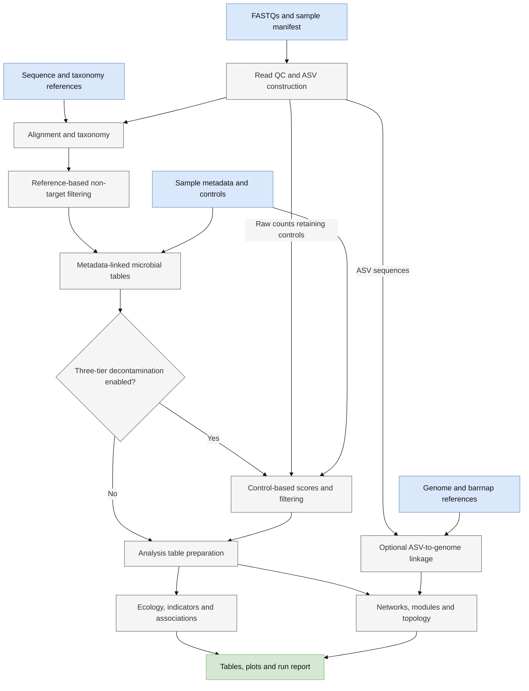
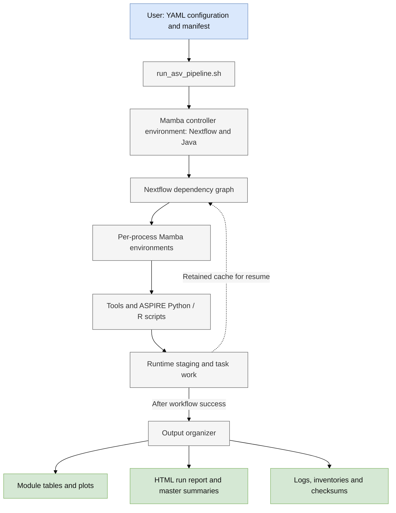
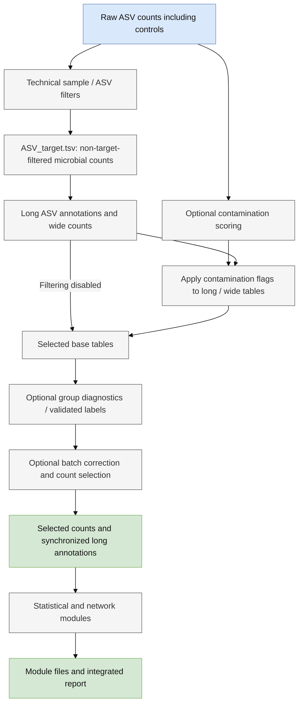
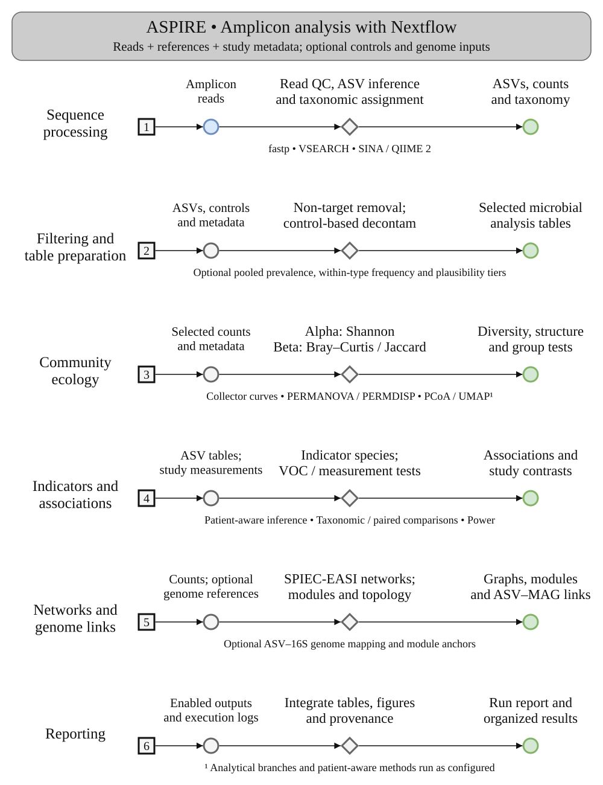

# Workflow, architecture and data flow

[Download SVG](assets/workflow.svg) · [Download PDF](assets/workflow.pdf)

The figure groups the complete workflow into conceptual modules. Numbered rows
are not a serial execution schedule. Optional analyses run only when enabled
and their dependencies are available. The [process reference](PROCESS_REFERENCE.md)
lists the exact task names, inputs and outputs.

## Conceptual workflow

Three-tier filtering scores contaminants from the raw control-bearing counts,
then filters the microbial analysis tables. Batch correction and proposed group
labels are separately configurable. Network edges and ASV–VOC correlations are
associations, rather than evidence of causal relationships.

## Software architecture

The supported entrypoint is the wrapper. It handles environment setup, resume,
logging and final publication. Independent tasks can overlap when resources
permit. Per-task threads are not a global concurrency limit. See
[expert execution guidance](EXPERT_GUIDE.md) before changing runtime locations
or passing native Nextflow options.

## Data flow and the selected analysis table

The diagrams summarize the analytical table path. Individual descriptive
products can use their own declared metadata or intermediate inputs; consult
the process I/O reference before treating every report panel as the same cohort.
ASV-to-genome linkage uses the filtered ASV sequences and supplied genome
references; network overlays combine those links with the selected analytical
network. Exact file paths and checksums are recorded in the output inventories.

## Brief appnote panel

[Brief SVG](assets/workflow-brief.svg) · [Brief PDF](assets/workflow-brief.pdf)

This smaller figure groups the workflow into sequence processing, filtering, optional analytical branches and reporting. Use the complete figure above for individual tools and the three-tier filtering details.
